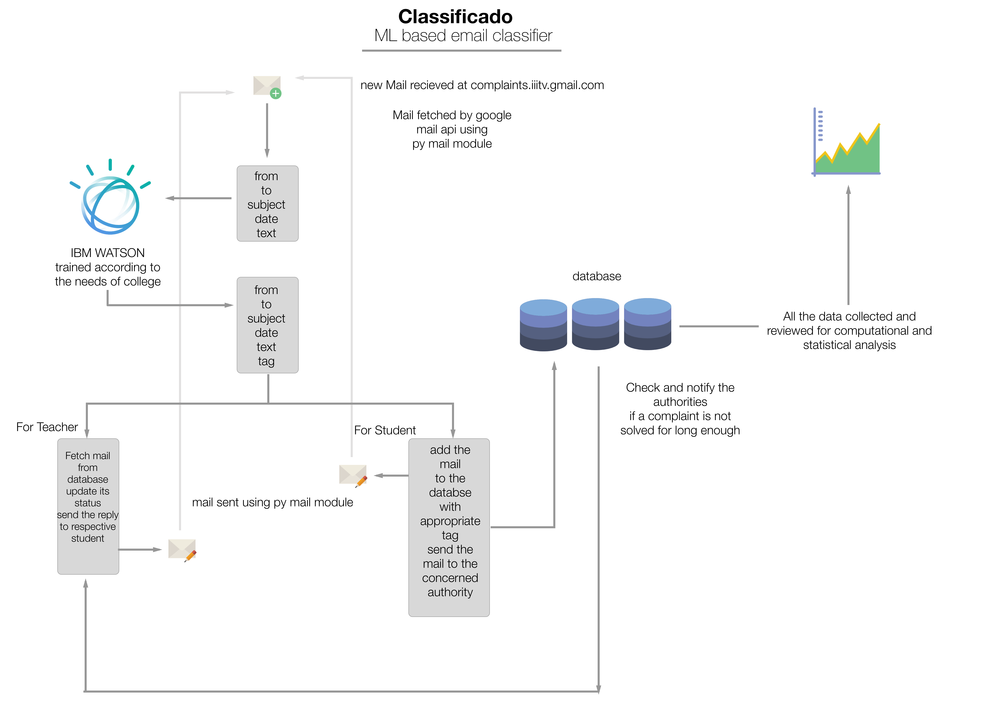

# Classificado 

>Made with ML and :snake:

A python based mail classifier 

Students in every college suffer various difficulties. They can complain to the authorities in charge. But here is the catch. We often don’t know which authority to go and ask for. It’s illogical anyway , I mean you don’t need to go looking for who to complain.
So here is the solution, Classificado, a mail classifier that uses the magic of machine learning, beautifully integrated with google mail API, to provide you a seamless service that sorts the mails according to the given complaint.
Just email any concern or problem on a single mailing id. And let the tech do the hard work for you. We sort the mails according to a given college structure. That is we give your email to the authority that it actually concerns. Rather than just tossing it around
This not only gets the work done quickly but also saves the authorities' time 
We help improve the college-committees by providing them with an in-depth statistical analysis of all the complains and help them keep a neat record. 

## Here is the workflow

>We believe that for an Institute to actually work efficiently towards students concern, it must first know what are the concerns of the students. So we did that for you, or rather everyone. The IBM Watson is trained according most of the institutes in the world. It has proved accuracy close to 100% for all the cases. Our mailing system works seamlessly to provide you a frictionless environment. 

### Support: 

IBM Watson Conversations
